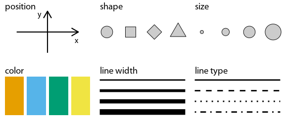
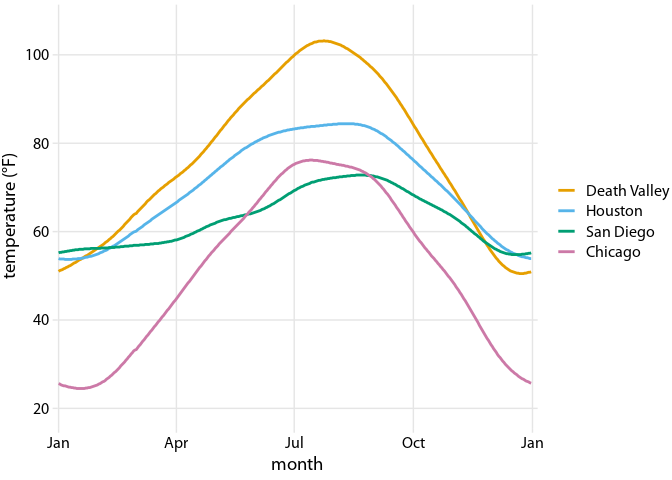

Ch01: Visualizing data: Mapping data onto aesthetics
================

``` r
library(forcats)
library(patchwork)
library(lubridate)
```

    ## 
    ## 다음의 패키지를 부착합니다: 'lubridate'

    ## The following objects are masked from 'package:base':
    ## 
    ##     date, intersect, setdiff, union

``` r
library(cowplot)
```

    ## 
    ## 다음의 패키지를 부착합니다: 'cowplot'

    ## The following object is masked from 'package:lubridate':
    ## 
    ##     stamp

    ## The following object is masked from 'package:patchwork':
    ## 
    ##     align_plots

``` r
library(dviz.supp)
```

    ## 필요한 패키지를 로딩중입니다: colorspace

    ## 필요한 패키지를 로딩중입니다: colorblindr

    ## 필요한 패키지를 로딩중입니다: ggplot2

    ## 필요한 패키지를 로딩중입니다: dplyr

    ## 
    ## 다음의 패키지를 부착합니다: 'dplyr'

    ## The following objects are masked from 'package:stats':
    ## 
    ##     filter, lag

    ## The following objects are masked from 'package:base':
    ## 
    ##     intersect, setdiff, setequal, union

    ## 
    ## 다음의 패키지를 부착합니다: 'dviz.supp'

    ## The following objects are masked from 'package:cowplot':
    ## 
    ##     plot_grid, stamp, stamp_bad, stamp_good, stamp_ugly, stamp_wrong

    ## The following object is masked from 'package:lubridate':
    ## 
    ##     stamp

    ## The following object is masked from 'package:datasets':
    ## 
    ##     CO2

``` r
aes_pos <- ggdraw() + 
  geom_segment(data = data.frame(x = c(0, 0.5),
                                 xend = c(1, 0.5),
                                 y = c(0.5, 0),
                                 yend = c(0.5, 1)),
                aes(x = x, y = y, xend = xend, yend = yend),
                arrow = arrow(length = grid::unit(12, "pt")), size = .75) +
  draw_text("y", .5, 1, size = 12, vjust = 1, hjust = 2.5, family = dviz_font_family) +
  draw_text("x", 1, .5, size = 12, vjust = 2, hjust = 1, family = dviz_font_family) + 
  coord_cartesian(xlim = c(-.2, 1.2), ylim = c(-.2, 1.2))
```

    ## Coordinate system already present. Adding new coordinate system, which will replace the existing one.

``` r
aes_color <- ggdraw() +
  geom_tile(data = data.frame(x = 0.15 + .2333*(0:3)),
            aes(x, y = .5, fill = factor(x)), width = .2, height = .6) +
  scale_fill_OkabeIto(guide = "none")

aes_shape <- ggdraw() +
  geom_point(data = data.frame(x = (.5 + 0:3)/4),
             aes(x, y = .5, shape = factor(x)), size = 8, fill = "grey80") +
  scale_shape_manual(values = 21:24)

aes_size <- ggdraw() +
  geom_point(data = data.frame(x = (.5 + 0:3)/4),
             aes(x, y = .5, size = factor(x)), shape = 21, fill = "grey80") +
  scale_size_manual(values = c(2, 5, 8, 11))

aes_lwd <- ggdraw() +
  geom_segment(data = data.frame(x = rep(0.05, 4),
                                 xend = rep(0.95, 4),
                                 y = (1.5 + 0:3)/6,
                                 yend = (1.5 + 0:3)/6,
                                 size = 4:1),
               aes(x = x, y = y, xend = xend, yend = yend, size = size)) +
  scale_size_identity()

aes_ltp <- ggdraw() +
  geom_segment(data = data.frame(x = rep(0.05, 4),
                                 xend = rep(0.95, 4),
                                 y = (1.5 + 0:3)/6,
                                 yend = (1.5 + 0:3)/6,
                                 linetype = 4:1),
               aes(x = x, y = y, xend = xend, yend = yend, linetype = linetype), size = 1) +
  scale_linetype_identity()


plot_grid(aes_pos, aes_shape, aes_size,
          aes_color, aes_lwd, aes_ltp,
          ncol = 3,
          labels = c("position", "shape", "size", "color", "line width", "line type"),
          label_x = 0.05, label_y = 0.95, hjust = 0, vjust = 1)
```



``` r
df <- data.frame(x = c(1:4))

scale_num <- ggplot(df, aes(x)) + 
  geom_point(size = 3, color = "#0072B2", y = 1) + 
  scale_y_continuous(limits = c(0.8, 1.2), expand = c(0, 0), breaks = 1, label = "position  ") +
  scale_x_continuous(limits = c(.7, 4.4), breaks = 1:5, labels = c("1", "2", "3", "4", "5"), name = NULL, position = "top") +
  theme_dviz_grid() +
  theme(axis.ticks.length = grid::unit(0, "pt"),
        axis.text = element_text(size = 14),
        axis.title.y = element_blank(),
        axis.ticks.y = element_blank())

scale_color <- ggplot(df, aes(x, color = factor(x), fill = factor(x))) + 
  geom_point(size = 5, shape = 22, y = 1) + 
  scale_y_continuous(limits = c(0.8, 1.2), expand = c(0, 0), breaks = 1, label = "color  ") +
  scale_x_continuous(limits = c(.7, 4.4), breaks = NULL) +
  scale_color_manual(values = darken(c("#0082A6", "#4EBBB9", "#9CDFC2", "#D8F0CD"), .1), guide = "none") +
  scale_fill_manual(values = c("#0082A6", "#4EBBB9", "#9CDFC2", "#D8F0CD"), guide = "none") +
  theme_dviz_grid() +
  theme(axis.ticks.length = grid::unit(0, "pt"),
        axis.text.x = element_blank(),
        axis.text.y = element_text(size = 14),
        axis.title = element_blank(),
        axis.ticks = element_blank(),
        panel.grid.major = element_blank()) 

scale_shape <- ggplot(df, aes(x, shape = factor(x))) + 
  geom_point(size = 4, color = "grey30", y = 1, fill = "grey80") + 
  scale_y_continuous(limits = c(0.8, 1.2), expand = c(0, 0), breaks = 1, label = "shape  ") +
  scale_x_continuous(limits = c(.7, 4.4), breaks = NULL) +
  scale_shape_manual(values = 21:24, guide = "none") +
  theme_dviz_grid() +
  theme(axis.ticks.length = grid::unit(0, "pt"),
        axis.text.x = element_blank(),
        axis.text.y = element_text(size = 14),
        axis.title = element_blank(),
        axis.ticks = element_blank(),
        panel.grid.major = element_blank()) 

scale_num + scale_shape + scale_color + plot_layout(ncol = 1)
```


``` r
temps_long <- filter(ncdc_normals,
                station_id %in% c(
                  "USW00014819", # Chicago, IL 60638
                  #"USC00516128", # Honolulu, HI 96813
                  #"USW00027502", # Barrow, AK 99723, coldest point in the US
                  "USC00042319", # Death Valley, CA 92328 hottest point in the US
                  "USW00093107", # San Diego, CA 92145
                  #"USC00427606"  # Salt Lake City, UT 84103
                  "USW00012918" # Houston, TX 77061
                )) %>%
  mutate(location = fct_recode(factor(station_id),
                               "Chicago" = "USW00014819",
                               #"Honolulu, HI" = "USC00516128",
                               #"Barrow, AK" = "USW00027502",
                               "Death Valley" = "USC00042319",
                               "San Diego" = "USW00093107",
                               #"Salt Lake City, UT" = "USC00427606",
                               "Houston" = "USW00012918")) %>%
  mutate(location = factor(location, levels = c("Death Valley", "Houston", "San Diego", "Chicago")))

ggplot(temps_long, aes(x = date, y = temperature, color = location)) +
  geom_line(size = 1) +
  scale_x_date(name = "month", limits = c(ymd("0000-01-01"), ymd("0001-01-04")),
               breaks = c(ymd("0000-01-01"), ymd("0000-04-01"), ymd("0000-07-01"),
                          ymd("0000-10-01"), ymd("0001-01-01")),
               labels = c("Jan", "Apr", "Jul", "Oct", "Jan"), expand = c(1/366, 0)) + 
  scale_y_continuous(limits = c(19.9, 107),
                     breaks = seq(20, 100, by = 20),
                     name = "temperature (°F)") +
  scale_color_OkabeIto(order = c(1:3, 7), name = NULL) +
  theme_dviz_grid() +
  theme(legend.title.align = 0.5)
```



``` r
month_names <- c("01" = "Jan", "02" = "Feb", "03" = "Mar", "04" = "Apr", "05" = "May", "06" = "Jun",
                   "07" = "Jul", "08" = "Aug", "09" = "Sep", "10" = "Oct", "11" = "Nov", "12" = "Dec")


mean_temps <- temps_long %>%
  group_by(location, month) %>%
  summarize(mean = mean(temperature)) %>%
  ungroup() %>%
  mutate(month = month_names[month]) %>%
  mutate(month = factor(month, levels = unname(month_names)))
```

    ## `summarise()` has grouped output by 'location'. You can override using the `.groups` argument.

``` r
p <- ggplot(mean_temps, aes(x = month, y = location, fill = mean)) + 
  geom_tile(width = .95, height = 0.95) + 
  scale_fill_viridis_c(option = "B", begin = 0.15, end = 0.98,
                       name = "temperature (°F)") + 
  scale_y_discrete(name = NULL) +
  coord_fixed(expand = FALSE) +
  theme_dviz_open() +
  theme(axis.line = element_blank(),
        axis.ticks = element_blank(),
        #axis.text.y = element_text(size = 14),
        legend.title = element_text(size = 12)
        )

# fix legend (make it centered)
ggdraw(align_legend(p))
```


