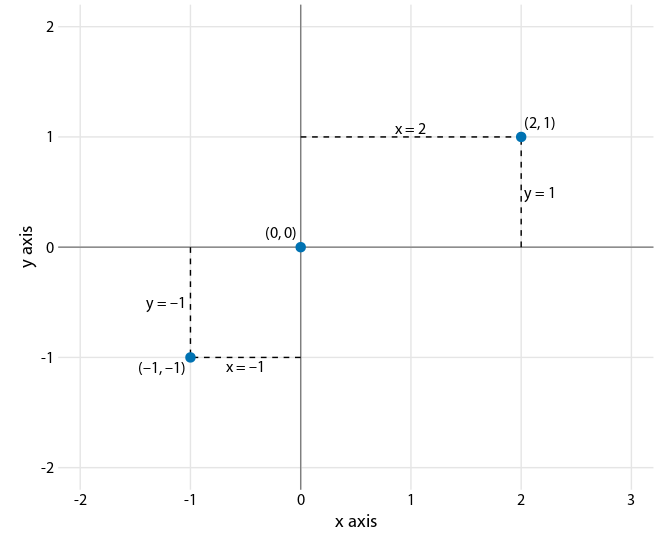
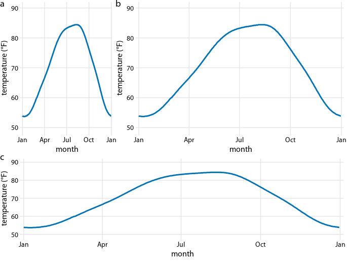
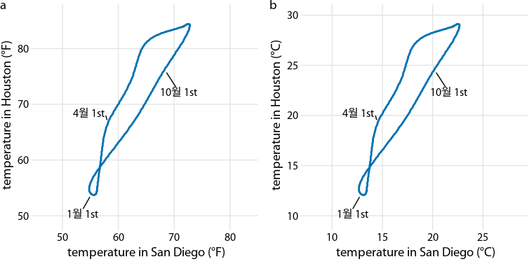
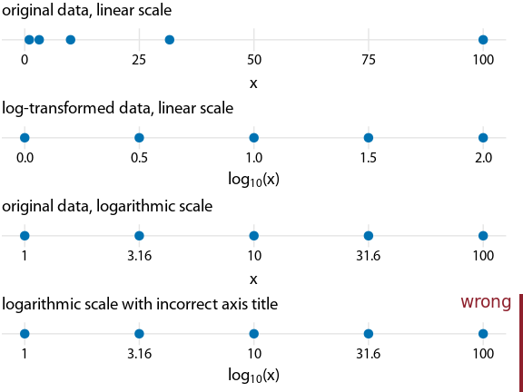
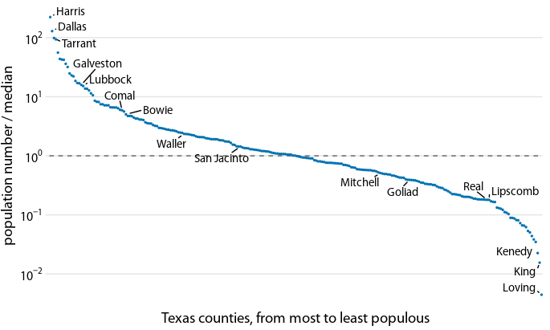
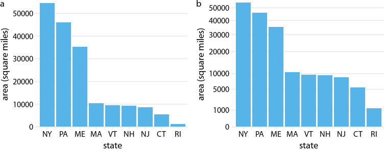

Ch03: coordinate scale
================

``` r
library(lubridate)
```

    ## 
    ## 다음의 패키지를 부착합니다: 'lubridate'

    ## The following objects are masked from 'package:base':
    ## 
    ##     date, intersect, setdiff, union

``` r
library(forcats)
library(tidyr)
library(ggrepel)
```

    ## 필요한 패키지를 로딩중입니다: ggplot2

``` r
library(dviz.supp)
```

    ## 필요한 패키지를 로딩중입니다: cowplot

    ## 
    ## 다음의 패키지를 부착합니다: 'cowplot'

    ## The following object is masked from 'package:lubridate':
    ## 
    ##     stamp

    ## 필요한 패키지를 로딩중입니다: colorspace

    ## 필요한 패키지를 로딩중입니다: colorblindr

    ## 필요한 패키지를 로딩중입니다: dplyr

    ## 
    ## 다음의 패키지를 부착합니다: 'dplyr'

    ## The following objects are masked from 'package:stats':
    ## 
    ##     filter, lag

    ## The following objects are masked from 'package:base':
    ## 
    ##     intersect, setdiff, setequal, union

    ## 
    ## 다음의 패키지를 부착합니다: 'dviz.supp'

    ## The following objects are masked from 'package:cowplot':
    ## 
    ##     plot_grid, stamp, stamp_bad, stamp_good, stamp_ugly, stamp_wrong

    ## The following object is masked from 'package:lubridate':
    ## 
    ##     stamp

    ## The following object is masked from 'package:datasets':
    ## 
    ##     CO2

## Cartesian coordinates

``` r
df_points <- data.frame(x = c(-1, 0, 2),
                        y = c(-1, 0, 1),
                        label = c("(–1, –1)", "(0, 0)", "(2, 1)"),
                        vjust = c(1.4, -.8, -.8),
                        hjust = c(1.1, 1.1, -.1))

df_segments <- data.frame(x0 = c(0, 2, 0, -1),
                          x1 = c(2, 2, -1, -1),
                          y0 = c(1, 0, -1, 0),
                          y1 = c(1, 1, -1, -1))

df_labels <- data.frame(x = c(-1, -.5, 1, 2),
                        y = c(-.5, -1, 1, 0.5),
                        vjust = c(.5, 1.3, -.3, .5),
                        hjust = c(1.1, .5, .5, -.1),
                        label = c("y = –1", "x = –1", "x = 2", "y = 1"))

ggplot(df_points, aes(x, y)) +
  geom_hline(yintercept = 0, color = "gray50") +
  geom_vline(xintercept = 0, color = "gray50") +
  geom_segment(data = df_segments, aes(x = x0, xend = x1, y = y0, yend = y1),
               linetype = 2) +
  geom_point(size = 3, color = "#0072B2") +
  geom_text(aes(label = label, vjust = vjust, hjust = hjust),
            size = 12/.pt, family = dviz_font_family) +
  geom_text(data = df_labels, aes(label = label, hjust = hjust, vjust = vjust),
            size = 12/.pt, family = dviz_font_family) +
  coord_fixed(xlim = c(-2.2, 3.2), ylim = c(-2.2, 2.2), expand = FALSE) +
  xlab("x axis") +
  ylab("y axis") +
  theme_dviz_grid() +
  theme(axis.ticks.length = grid::unit(0, "pt"))
```



``` r
temps_wide <- filter(ncdc_normals,
                station_id %in% c(
                  "USW00014819", # Chicago, IL 60638
                  "USC00516128", # Honolulu, HI 96813
                  "USW00027502", # Barrow, AK 99723, coldest point in the US
                  "USC00042319", # Death Valley, CA 92328 hottest point in the US
                  "USW00093107", # San Diego, CA 92145
                  "USW00012918", # Houston, TX 77061
                  "USC00427606"  # Salt Lake City, UT 84103
                )) %>%
  mutate(location = fct_recode(factor(station_id),
                               "Chicago" = "USW00014819",
                               "Honolulu" = "USC00516128",
                               "Barrow, AK" = "USW00027502",
                               "Death Valley" = "USC00042319",
                               "San Diego" = "USW00093107",
                               "Houston" = "USW00012918",
                               "Salt Lake City, UT" = "USC00427606")) %>%
  select(-station_id, -flag) %>%
  spread(location, temperature) %>%
  arrange(date)

temps_wide_label <- mutate(
  temps_wide,
  label = ifelse(
    date %in% c(ymd("0000-01-01"), ymd("0000-04-01"), ymd("0000-07-01"), ymd("0000-10-01")),
    format(date, "%b 1st"),
    ""
  ),
  nudge_x = ifelse(
    date %in% c(ymd("0000-01-01"), ymd("0000-04-01"), ymd("0000-07-01"), ymd("0000-10-01")),
    c(-1, -2, -2, 1)[round(month(date)/3)+1],
    0
  ),
  nudge_y = ifelse(
    date %in% c(ymd("0000-01-01"), ymd("0000-04-01"), ymd("0000-07-01"), ymd("0000-10-01")),
    c(-2, 1, 0.5, -2)[round(month(date)/3)+1],
    0
  )
)

temp_plot <- ggplot(temps_wide_label, aes(x = date, y = `Houston`)) +
  geom_line(size = 1, color = "#0072B2") +
  scale_x_date(name = "month", limits = c(ymd("0000-01-01"), ymd("0001-01-03")),
               breaks = c(ymd("0000-01-01"), ymd("0000-04-01"), ymd("0000-07-01"),
                          ymd("0000-10-01"), ymd("0001-01-01")),
               labels = c("Jan", "Apr", "Jul", "Oct", "Jan"), expand = c(2/366, 0)) + 
  scale_y_continuous(limits = c(50, 90),
                     name = "temperature (°F)") +
  theme_dviz_grid(12) +
  theme(plot.margin = margin(3, 5, 3, 1.5))

plot_grid(
  plot_grid(
    temp_plot, temp_plot, rel_widths = c(1, 2), labels = c("a", "b"), nrow = 1
  ),
  temp_plot,
  rel_heights = c(1.5, 1), labels = c("", "c"), label_y = c(1, 1.03), ncol = 1
)
```



``` r
tempsplot_F <- ggplot(temps_wide_label, aes(x = `San Diego`, y = `Houston`)) +
  geom_path(size = 1, color = "#0072B2") +
  geom_text_repel(
    aes(label = label), point.padding = .4, color = "black",
    min.segment.length = 0, size = 12/.pt,
    family = dviz_font_family,
    nudge_x = (9/5)*temps_wide_label$nudge_x,
    nudge_y = (9/5)*temps_wide_label$nudge_y
  ) +
  coord_fixed(
    xlim = c(45, 85), ylim = c(48, 88),
    expand = FALSE
  ) +
  scale_color_continuous_qualitative(guide = "none") +
  scale_x_continuous(breaks = c(10*(5:8))) +
  xlab("temperature in San Diego (°F)") +
  ylab("temperature in Houston (°F)") +
  theme_dviz_grid() +
  theme(plot.margin = margin(3, 1.5, 3, 1.5))

# Fahrenheit to Celsius conversion

F2C <- function(t) {(t-32)*5/9}

tempsplot_C <- ggplot(temps_wide_label, aes(x = F2C(`San Diego`), y = F2C(`Houston`))) +
  geom_path(size = 1, color = "#0072B2") +
  geom_text_repel(
    aes(label = label), point.padding = .4, color = "black",
    min.segment.length = 0, size = 12/.pt,
    family = dviz_font_family,
    nudge_x = temps_wide_label$nudge_x,
    nudge_y = temps_wide_label$nudge_y
  ) +
  coord_fixed(
    xlim = F2C(c(45, 85)), ylim = F2C(c(48, 88)),
    expand = FALSE
  ) +
  scale_color_continuous_qualitative(guide = "none") +
  scale_x_continuous(breaks = c(5*(2:6))) +
  xlab("temperature in San Diego (°C)") +
  ylab("temperature in Houston (°C)") +
  theme_dviz_grid() +
  theme(plot.margin = margin(3, 1.5, 3, 1.5))


plot_grid(
  tempsplot_F, NULL, tempsplot_C,
  labels = c("a", "", "b"), nrow = 1, rel_widths = c(1, .04, 1)
)
```

    ## Warning: ggrepel: 1 unlabeled data points (too many overlaps). Consider
    ## increasing max.overlaps

    ## Warning: ggrepel: 1 unlabeled data points (too many overlaps). Consider
    ## increasing max.overlaps



## nonlinear axes

``` r
df <- data.frame(x = c(1, 3.16, 10, 31.6, 100))

xaxis_lin <- ggplot(df, aes(x, y = 1)) + 
  geom_point(size = 3, color = "#0072B2") + 
  scale_y_continuous(limits = c(0.8, 1.2), expand = c(0, 0), breaks = 1) +
  theme_dviz_grid(14, rel_large = 1) +
  theme(axis.ticks.length = grid::unit(0, "pt"),
        axis.text.y = element_blank(),
        axis.title.y = element_blank(),
        axis.ticks.y = element_blank(),
        plot.title = element_text(face = "plain"),
        plot.margin = margin(3, 14, 3, 1.5))

xaxis_log <- ggplot(df, aes(log10(x), y = 1)) + 
  geom_point(size = 3, color = "#0072B2") + 
  scale_y_continuous(limits = c(0.8, 1.2), expand = c(0, 0), breaks = 1) +
  theme_dviz_grid(14, rel_large = 1) +
  theme(axis.ticks.length = grid::unit(0, "pt"),
        axis.text.y = element_blank(),
        axis.title.y = element_blank(),
        axis.ticks.y = element_blank(),
        plot.title = element_text(face = "plain"),
        plot.margin = margin(3, 14, 3, 1.5))

plotlist <- 
  align_plots(xaxis_lin + scale_x_continuous(limits = c(0, 100)) + 
                ggtitle("original data, linear scale"),
              xaxis_log + scale_x_continuous(limits = c(0, 2)) +
                xlab(expression(paste("log"["10"], "(x)"))) + 
                ggtitle("log-transformed data, linear scale"),
              xaxis_lin + scale_x_log10(limits = c(1, 100), breaks = c(1, 3.16, 10, 31.6, 100),
                                        labels = c("1", "3.16", "10", "31.6", "100")) + 
                ggtitle("original data, logarithmic scale"),
              xaxis_lin + scale_x_log10(limits = c(1, 100), breaks = c(1, 3.16, 10, 31.6, 100),
                                        labels = c("1", "3.16", "10", "31.6", "100")) +
                xlab(expression(paste("log"["10"], "(x)"))) + 
                ggtitle("logarithmic scale with incorrect axis title"),
              align = 'vh')

plot_grid(plotlist[[1]], plotlist[[2]], plotlist[[3]], stamp_wrong(plotlist[[4]]), ncol = 1)
```



``` r
set.seed(3878)
US_census %>% filter(state == "Texas") %>%
  select(name, pop2010) %>%
  extract(name, "county", regex = "(.+) County") %>%
  mutate(popratio = pop2010/median(pop2010)) %>%
  arrange(desc(popratio)) %>%
  mutate(index = 1:n(),
         label = ifelse(index <= 3 | index > n()-3 | runif(n()) < .04, county, ""),
         label_large = ifelse(index <= 6, county, "")) -> tx_counties

ggplot(tx_counties, aes(x = index, y = popratio)) +
  geom_hline(yintercept = 1, linetype = 2, color = "grey40") +
  geom_point(size = 0.5, color = "#0072B2") +
  geom_text_repel(aes(label = label), point.padding = .4, color = "black",
                  min.segment.length = 0, family = dviz_font_family, max.overlaps=40) +
  scale_y_log10(breaks = c(.01, .1, 1, 10, 100),
                name = "population number / median",
                labels = label_log10) +
  scale_x_continuous(limits = c(.5, nrow(tx_counties) + .5), expand = c(0, 0),
                     breaks = NULL, #c(1, 50*(1:5)),
                     name = "Texas counties, from most to least populous") +
  theme_dviz_hgrid() +
  theme(axis.line = element_blank(),
        plot.margin = margin(3, 7, 3, 1.5))
```



``` r
# areas in square miles
# source: Google, 01/07/2018
northeast_areas <- read.csv(text = "state_abr,area
NY,54556
PA,46055
ME,35385
MA,10565
VT,9616
NH,9349
NJ,8723
CT,5543
RI,1212")

northeast_areas$state_abr <- factor(northeast_areas$state_abr, levels = northeast_areas$state_abr)

areas_base <- ggplot(northeast_areas, aes(x = state_abr, y = area)) +
  geom_col(fill = "#56B4E9") +
  ylab("area (square miles)") +
  xlab("state") +
  theme_dviz_hgrid() +
  theme(plot.margin = margin(3, 1.5, 3, 1.5))

p1 <- areas_base + scale_y_sqrt(limits = c(0, 55000), breaks = c(0, 1000, 5000, 10000*(1:5)), 
                                expand = c(0, 0))
  
p2 <- areas_base + scale_y_continuous(limits = c(0, 55000), breaks = 10000*(0:6), expand = c(0, 0))

plot_grid(
  p2, NULL, p1,
  labels = c("a", "", "b"), nrow = 1, rel_widths = c(1, .04, 1)
)
```



## Coordinate systems with curved axes
