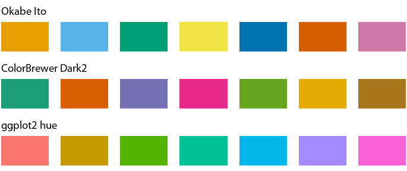
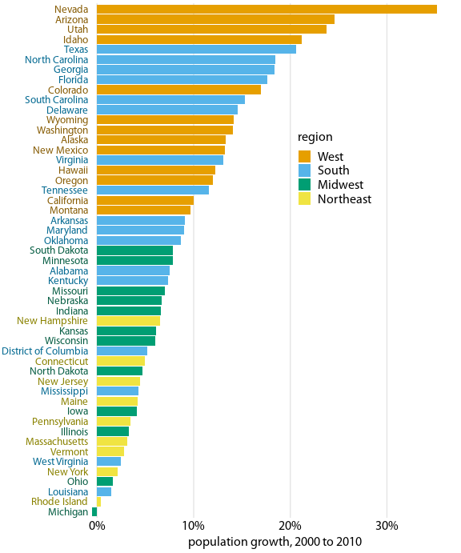
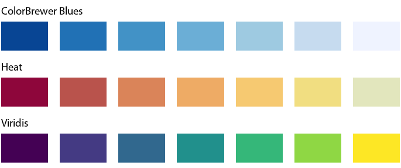
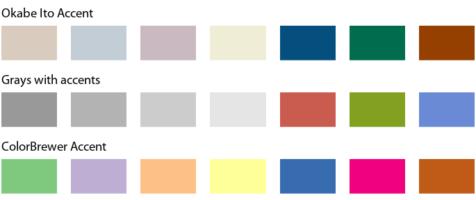
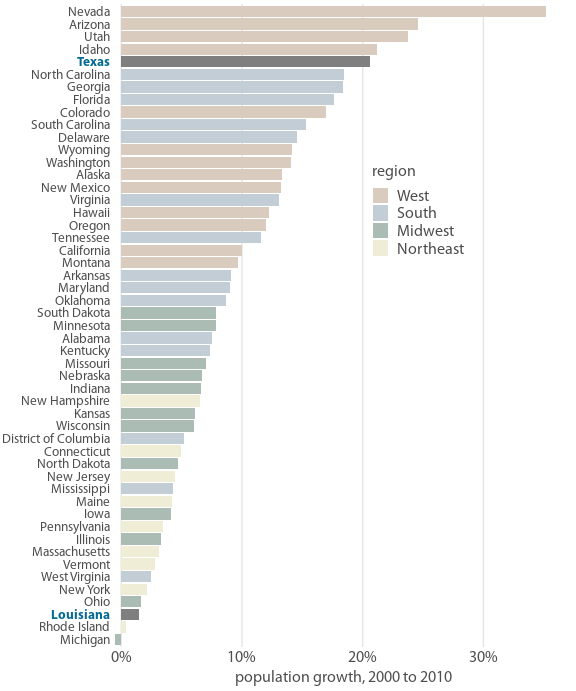
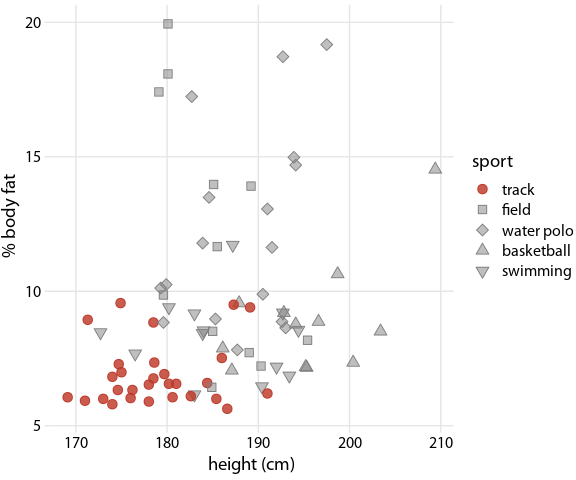

ch04 color basics
================

``` r
library(forcats)
library(patchwork)
library(lubridate)
```

    ## 
    ## 다음의 패키지를 부착합니다: 'lubridate'

    ## The following objects are masked from 'package:base':
    ## 
    ##     date, intersect, setdiff, union

``` r
library(cowplot)
```

    ## 
    ## 다음의 패키지를 부착합니다: 'cowplot'

    ## The following object is masked from 'package:lubridate':
    ## 
    ##     stamp

    ## The following object is masked from 'package:patchwork':
    ## 
    ##     align_plots

``` r
library(dviz.supp)
```

    ## 필요한 패키지를 로딩중입니다: colorspace

    ## 필요한 패키지를 로딩중입니다: colorblindr

    ## 필요한 패키지를 로딩중입니다: ggplot2

    ## 필요한 패키지를 로딩중입니다: dplyr

    ## 
    ## 다음의 패키지를 부착합니다: 'dplyr'

    ## The following objects are masked from 'package:stats':
    ## 
    ##     filter, lag

    ## The following objects are masked from 'package:base':
    ## 
    ##     intersect, setdiff, setequal, union

    ## 
    ## 다음의 패키지를 부착합니다: 'dviz.supp'

    ## The following objects are masked from 'package:cowplot':
    ## 
    ##     plot_grid, stamp, stamp_bad, stamp_good, stamp_ugly, stamp_wrong

    ## The following object is masked from 'package:lubridate':
    ## 
    ##     stamp

    ## The following object is masked from 'package:datasets':
    ## 
    ##     CO2

``` r
library(sf)
```

    ## Linking to GEOS 3.8.0, GDAL 3.0.4, PROJ 6.3.1

## Color as a tool to distinguish

``` r
p1 <- gg_color_swatches(7, title_family = dviz_font_family) + 
  scale_fill_OkabeIto() + ggtitle("Okabe Ito") +
  theme(plot.margin = margin(7, 1.5, 7, 1.5))
p2 <- gg_color_swatches(7, title_family = dviz_font_family) + 
  scale_fill_brewer(type = "qual", palette = "Dark2") + ggtitle("ColorBrewer Dark2") +
  theme(plot.margin = margin(7, 1.5, 7, 1.5))
p3 <- gg_color_swatches(7, title_family = dviz_font_family) + 
  scale_fill_hue() + ggtitle("ggplot2 hue") +
  theme(plot.margin = margin(7, 1.5, 7, 1.5))
plot_grid(p1, p2, p3, ncol = 1)
```



## how we use qualitative color scales

``` r
popgrowth_df <- left_join(US_census, US_regions) %>%
    group_by(region, division, state) %>%
    summarize(pop2000 = sum(pop2000, na.rm = TRUE),
              pop2010 = sum(pop2010, na.rm = TRUE),
              popgrowth = (pop2010-pop2000)/pop2000,
              area = sum(area)) %>%
    arrange(popgrowth) %>%
    ungroup() %>%
    mutate(state = factor(state, levels = state),
           region = factor(region, levels = c("West", "South", "Midwest", "Northeast")))
```

    ## Joining, by = "state"

    ## `summarise()` has grouped output by 'region', 'division'. You can override using the `.groups` argument.

``` r
# make color vector in order of the state
region_colors <- c("#E69F00", "#56B4E9", "#009E73", "#F0E442")
region_colors_dark <- darken(region_colors, 0.4)
state_colors <- region_colors_dark[as.numeric(popgrowth_df$region[order(popgrowth_df$state)])]

ggplot(popgrowth_df, aes(x = state, y = 100*popgrowth, fill = region)) + 
  geom_col() + 
  scale_y_continuous(
    limits = c(-.6, 37.5), expand = c(0, 0),
    labels = scales::percent_format(accuracy = 1, scale = 1),
    name = "population growth, 2000 to 2010"
  ) +
  scale_fill_manual(values = region_colors) +
  coord_flip() + 
  theme_dviz_vgrid(12, rel_small = 1) +
  theme(axis.title.y = element_blank(),
        axis.line.y = element_blank(),
        axis.ticks.length = unit(0, "pt"),
        axis.text.y = element_text(size = 10, color = state_colors),
        legend.position = c(.56, .68),
        #legend.text = element_text(color = region_colors),
        legend.background = element_rect(fill = "#ffffffb0"))
```

    ## Warning: Vectorized input to `element_text()` is not officially supported.
    ## Results may be unexpected or may change in future versions of ggplot2.



## Color to represent data values

### 순차적 색상

``` r
p1 <- gg_color_swatches(7, title_family = dviz_font_family) + 
  scale_fill_brewer(type = "seq", palette = "Blues", direction = -1) + ggtitle("ColorBrewer Blues") +
  theme(plot.margin = margin(7, 1.5, 7, 1.5))
p2 <- gg_color_swatches(7, title_family = dviz_font_family) + 
  scale_fill_discrete_sequential("Heat", rev = FALSE) + ggtitle("Heat") +
  theme(plot.margin = margin(7, 1.5, 7, 1.5))
p3 <- gg_color_swatches(7, title_family = dviz_font_family) + 
  scale_fill_viridis_d() + ggtitle("Viridis") +
  theme(plot.margin = margin(7, 1.5, 7, 1.5))
plot_grid(p1, p2, p3, ncol = 1)
```



### 발산형 색상

``` r
p1 <- gg_color_swatches(7, title_family = dviz_font_family) + 
  scale_fill_discrete_divergingx(palette = "Earth") + ggtitle("CARTO Earth") +
  theme(plot.margin = margin(7, 1.5, 7, 1.5))
p2 <- gg_color_swatches(7, title_family = dviz_font_family) + 
  scale_fill_brewer(type = "div", palette = "PiYG") + ggtitle("ColorBrewer PiYG") +
  theme(plot.margin = margin(7, 1.5, 7, 1.5))
p3 <- gg_color_swatches(7, title_family = dviz_font_family) + 
  scale_fill_discrete_diverging("Blue-Red") + ggtitle("Blue-Red") +
  theme(plot.margin = margin(7, 1.5, 7, 1.5))
plot_grid(p1, p2, p3, ncol = 1)
```


### 강조형 색상

``` r
accent_OkabeIto <- palette_OkabeIto[c(1, 2, 7, 4, 5, 3, 6)]
accent_OkabeIto[1:4] <- desaturate(lighten(accent_OkabeIto[1:4], .4), .8)
accent_OkabeIto[5:7] <- darken(accent_OkabeIto[5:7], .3)


p1 <- gg_color_swatches(7, title_family = dviz_font_family) + 
  scale_fill_manual(values = accent_OkabeIto) + ggtitle("Okabe Ito Accent") +
  theme(plot.margin = margin(7, 1.5, 7, 1.5))
p2 <- gg_color_swatches(7, title_family = dviz_font_family) + 
  scale_fill_manual(values = c("gray60", "gray70","gray80", "gray90", "#C95C4F",   '#83A121', '#6B8AD5')) + ggtitle("Grays with accents") +
  theme(plot.margin = margin(7, 1.5, 7, 1.5))
p3 <- gg_color_swatches(7, title_family = dviz_font_family) + 
  scale_fill_brewer(type = "qual", palette = "Accent") + ggtitle("ColorBrewer Accent") +
  theme(plot.margin = margin(7, 1.5, 7, 1.5))
plot_grid(p1, p2, p3, ncol = 1)
```



``` r
popgrowth_hilight <- left_join(US_census, US_regions) %>%
    group_by(region, division, state) %>%
    summarize(pop2000 = sum(pop2000, na.rm = TRUE),
              pop2010 = sum(pop2010, na.rm = TRUE),
              popgrowth = (pop2010-pop2000)/pop2000,
              area = sum(area)) %>%
    arrange(popgrowth) %>%
    ungroup() %>%
    mutate(region = ifelse(state %in% c("Texas", "Louisiana"), "highlight", region)) %>%
    mutate(state = factor(state, levels = state),
           region = factor(region, levels = c("West", "South", "Midwest", "Northeast", "highlight")))
```

    ## Joining, by = "state"

    ## `summarise()` has grouped output by 'region', 'division'. You can override using the `.groups` argument.

``` r
# make color and fontface vector in order of the states
region_colors_bars <- c(desaturate(lighten(c("#E69F00", "#56B4E9", "#009E73", "#F0E442"), .4), .8), darken("#56B4E9", .3))
region_colors_axis <- c(rep("gray30", 4), darken("#56B4E9", .4))
region_fontface <- c(rep("plain", 4), "bold")
state_colors <- region_colors_axis[as.numeric(popgrowth_hilight$region[order(popgrowth_hilight$state)])]
state_fontface <- region_fontface[as.numeric(popgrowth_hilight$region[order(popgrowth_hilight$state)])]

ggplot(popgrowth_hilight, aes(x = state, y = 100*popgrowth, fill = region)) + 
  geom_col() + 
  scale_y_continuous(
    limits = c(-.6, 37.5), expand = c(0, 0),
    labels = scales::percent_format(accuracy = 1, scale = 1),
    name = "population growth, 2000 to 2010"
  ) +
  scale_fill_manual(
    values = region_colors_bars,
    breaks = c("West", "South", "Midwest", "Northeast")
  ) +
  coord_flip() + 
  theme_dviz_vgrid(12, rel_small = 1) +
  theme(
    text = element_text(color = "gray30"),
    axis.text.x = element_text(color = "gray30"),
    axis.title.y = element_blank(),
    axis.line.y = element_blank(),
    axis.ticks.length = unit(0, "pt"),
    axis.text.y = element_text(
      size = 10, color = state_colors,
      face = state_fontface
    ),
    legend.position = c(.56, .68),
    legend.background = element_rect(fill = "#ffffffb0")
  )
```

    ## Warning: Vectorized input to `element_text()` is not officially supported.
    ## Results may be unexpected or may change in future versions of ggplot2.



``` r
male_Aus <- filter(Aus_athletes, sex=="m") %>%
  filter(sport %in% c("basketball", "field", "swimming", "track (400m)",
                      "track (sprint)", "water polo")) %>%
  mutate(sport = case_when(sport == "track (400m)" ~ "track",
                           sport == "track (sprint)" ~ "track",
                           TRUE ~ sport))

male_Aus$sport <- factor(male_Aus$sport,
                         levels = c("track", "field", "water polo", "basketball", "swimming"))

colors <- c("#BD3828", rep("#808080", 4))
fills <- c("#BD3828D0", rep("#80808080", 4))

ggplot(male_Aus, aes(x=height, y=pcBfat, shape=sport, color = sport, fill = sport)) +
  geom_point(size = 3) +
  scale_shape_manual(values = 21:25) +
  scale_color_manual(values = colors) +
  scale_fill_manual(values = fills) +
  xlab("height (cm)") +
  ylab("% body fat") +
  theme_dviz_grid()
```



a
