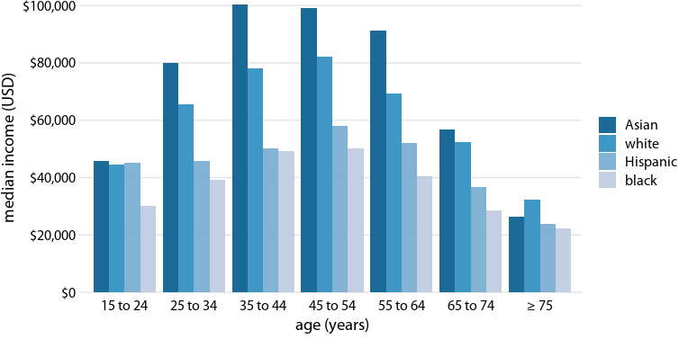

ch06\_visualizing\_amounts
================

``` r
library(forcats)
library(patchwork)
library(lubridate)
```

    ## 
    ## 다음의 패키지를 부착합니다: 'lubridate'

    ## The following objects are masked from 'package:base':
    ## 
    ##     date, intersect, setdiff, union

``` r
library(cowplot)
```

    ## 
    ## 다음의 패키지를 부착합니다: 'cowplot'

    ## The following object is masked from 'package:lubridate':
    ## 
    ##     stamp

    ## The following object is masked from 'package:patchwork':
    ## 
    ##     align_plots

``` r
library(dviz.supp)
```

    ## 필요한 패키지를 로딩중입니다: colorspace

    ## 필요한 패키지를 로딩중입니다: colorblindr

    ## 필요한 패키지를 로딩중입니다: ggplot2

    ## 필요한 패키지를 로딩중입니다: dplyr

    ## 
    ## 다음의 패키지를 부착합니다: 'dplyr'

    ## The following objects are masked from 'package:stats':
    ## 
    ##     filter, lag

    ## The following objects are masked from 'package:base':
    ## 
    ##     intersect, setdiff, setequal, union

    ## 
    ## 다음의 패키지를 부착합니다: 'dviz.supp'

    ## The following objects are masked from 'package:cowplot':
    ## 
    ##     plot_grid, stamp, stamp_bad, stamp_good, stamp_ugly, stamp_wrong

    ## The following object is masked from 'package:lubridate':
    ## 
    ##     stamp

    ## The following object is masked from 'package:datasets':
    ## 
    ##     CO2

``` r
library(gapminder)
```

# table

``` r
# source: Box Office Mojo
# URL: http://www.boxofficemojo.com/weekend/chart/?view=&yr=2017&wknd=51&p=.htm
# downloaded: 2018-02-11

boxoffice <- data.frame(rank = 1:5,
                        title = c("Star Wars: The Last Jedi", "Jumanji: Welcome to the Jungle", "Pitch Perfect 3", "The Greatest Showman", "Ferdinand"),
                        title_short = c("Star Wars", "Jumanji", "Pitch Perfect 3", "Greatest Showman", "Ferdinand"),
                        amount = c(71565498, 36169328, 19928525, 8805843, 7316746),
                        amount_text = c("$71,565,498", "$36,169,328", "$19,928,525", "$8,805,843", "$7,316,746"))

boxoffice_display <- boxoffice %>%
  select(rank, title, amount_text) %>%
  rename(Rank = rank,
         Title = title,
         `Weekend gross` = amount_text)
        

knitr::kable(
  boxoffice_display,
  caption = 'Highest grossing movies for the weekend of December 22-24, 2017', booktabs = TRUE,
  row.names = FALSE,
  align = c('c', 'l', 'r')
  #format = "html",
  #table.attr = "style = \"width: 75%\""
)
```

| Rank | Title                          | Weekend gross |
|:----:|:-------------------------------|--------------:|
|  1   | Star Wars: The Last Jedi       |   $71,565,498 |
|  2   | Jumanji: Welcome to the Jungle |   $36,169,328 |
|  3   | Pitch Perfect 3                |   $19,928,525 |
|  4   | The Greatest Showman           |    $8,805,843 |
|  5   | Ferdinand                      |    $7,316,746 |

Highest grossing movies for the weekend of December 22-24, 2017

# bar plot - basics with ordered factor

``` r
boxoffice %>%
  ggplot(aes(x = fct_reorder(title_short, rank), y = amount)) +
    geom_col(fill = "#56B4E9", width = 0.6, alpha = 0.9) +
    scale_y_continuous(expand = c(0, 0),
                       breaks = c(0, 2e7, 4e7, 6e7),
                       labels = c("0", "20", "40", "60"),
                       name = "weekend gross (million USD)") +
    scale_x_discrete(name = NULL,
                     expand = c(0, 0.4)) +
    coord_cartesian(clip = "off") +
    theme_dviz_hgrid(12, rel_small = 1) +
    theme(
      #axis.ticks.length = grid::unit(0, "pt"),
      axis.line.x = element_blank(),
      axis.ticks.x = element_blank()
    )
```


# bar plot - tilt text

``` r
boxoffice %>%
  ggplot(aes(x = fct_reorder(title_short, rank), y = amount)) +
    geom_col(fill = "#56B4E9", alpha = 0.9) +
    scale_y_continuous(expand = c(0, 0),
                       breaks = c(0, 2e7, 4e7, 6e7),
                       labels = c("0", "20", "40", "60"),
                       name = "weekend gross (million USD)") +
    scale_x_discrete(name = NULL) +
    coord_cartesian(clip = "off") +
    theme_dviz_hgrid(rel_small = 1) +
    theme(
      #axis.ticks.length = grid::unit(0, "pt"),
      axis.line.x = element_blank(),
      axis.ticks.x = element_blank(),
      axis.text.x = element_text(angle = 45, vjust = 1, hjust = 1),    # <------- 여기
      plot.margin = margin(3, 7, 3, 1.5)
    ) -> p_box_axrot

stamp_ugly(p_box_axrot)
```


# bar plot - change x/y

``` r
ggplot(boxoffice, aes(x = fct_reorder(title_short, desc(rank)), y = amount)) +
  geom_col(fill = "#56B4E9", alpha = 0.9) +
  scale_y_continuous(limits = c(0, 7.5e7),
                     expand = c(0, 0),
                     breaks = c(0, 2e7, 4e7, 6e7),
                     labels = c("0", "20", "40", "60"),
                     name = "weekend gross (million USD)") +
  scale_x_discrete(name = NULL,
                   expand = c(0, 0.5)) +
  coord_flip(clip = "off") +          # <------- 여기
  theme_dviz_vgrid(rel_small = 1) +
  theme(
    #axis.ticks.length = grid::unit(0, "pt"),
    axis.line.y = element_blank(),
    axis.ticks.y = element_blank()
  )
```


# Grouped bars - position dodge

``` r
income_by_age %>% filter(race %in% c("white", "asian", "black", "hispanic")) %>%
   mutate(race = fct_relevel(race, c("asian", "white", "hispanic", "black")),
          race = fct_recode(race, Asian = "asian", Hispanic = "hispanic"),
          age = fct_recode(age, "≥ 75" = "> 74")) -> income_df

# Take the darkest four colors from 5-class ColorBrewer palette "PuBu"
colors_four = RColorBrewer::brewer.pal(5, "PuBu")[5:2]

ggplot(income_df, aes(x = age, y = median_income, fill = race)) +  
  geom_col(position = "dodge", alpha = 0.9) +  # <------- 여기
  scale_y_continuous(
    expand = c(0, 0),
    name = "median income (USD)",
    breaks = c(0, 20000, 40000, 60000, 80000, 100000),
    labels = c("$0", "$20,000", "$40,000", "$60,000", "$80,000", "$100,000")
  ) +
  scale_fill_manual(values = colors_four, name = NULL) +
  coord_cartesian(clip = "off") +
  xlab("age (years)") +
  theme_dviz_hgrid() +
  theme(
    axis.line.x = element_blank(),
    axis.ticks.x = element_blank()
  ) -> p_income_race_dodged

p_income_race_dodged
```



# Grouped bars (by race)

``` r
# Take the darkest seven colors from 8-class ColorBrewer palette "PuBu"
colors_seven = RColorBrewer::brewer.pal(8, "PuBu")[2:8]

ggplot(income_df, aes(x = race, y = median_income, fill = age)) +     # <------- 여기
  geom_col(position = "dodge", alpha = 0.9) +
  scale_y_continuous(
    expand = c(0, 0),
    name = "median income (USD)",
    breaks = c(0, 20000, 40000, 60000, 80000, 100000),
    labels = c("$0", "$20,000", "$40,000", "$60,000", "$80,000", "$100,000")
  ) +
  scale_fill_manual(values = colors_seven, name = "age (yrs)") +
  coord_cartesian(clip = "off") +
  xlab(label = NULL) +
  theme_dviz_hgrid() +
  theme(
    axis.line.x = element_blank(),
    axis.ticks.x = element_blank(),
    legend.title.align = 0.5
  ) -> p_income_age_dodged

p_income_age_dodged
```


# grouped bars - seperate each race

``` r
income_df %>%
   mutate(age = fct_recode(age, "15–24" = "15 to 24", "25–34" = "25 to 34", "35–44" = "35 to 44",
                                "45–54" = "45 to 54", "55–64" = "55 to 64", "65–74" = "65 to 74")) -> income_age_abbrev_df

ggplot(income_age_abbrev_df, aes(x = age, y = median_income)) +
  geom_col(fill = "#56B4E9", alpha = 0.9) +
  scale_y_continuous(
    expand = c(0, 0),
    name = "median income (USD)",
    breaks = c(0, 20000, 40000, 60000, 80000, 100000),
    labels = c("$0", "$20,000", "$40,000", "$60,000", "$80,000", "$100,000")
  ) +
  coord_cartesian(clip = "off") +
  xlab(label = "age (years)") +
  facet_wrap(~race, scales = "free_x") +     # <------- 여기
  theme_dviz_hgrid(14) +
  theme(
    #axis.ticks.length = grid::unit(0, "pt"),
    axis.ticks.x = element_blank(),
    axis.line = element_blank(),
    strip.text = element_text(size = 14),
    panel.spacing.y = grid::unit(14, "pt")
  ) -> p_income_age_faceted

p_income_age_faceted
```


# stacked bar - position stack

``` r
titanic_groups <- titanic_all %>% filter(class != "*") %>% 
  select(class, sex) %>% 
  group_by(class, sex) %>% 
  tally() %>% arrange(class, desc(sex)) %>%
  mutate(sex = factor(sex, levels = c("female", "male"))) %>%
  group_by(class) %>%
  mutate(nlabel = cumsum(n) - n/2) %>%    # <-- box안의 숫자 표시 위치
  ungroup() %>%
  mutate(class = paste(class, "class"))

ggplot(titanic_groups, aes(x = class, y = n, fill = sex)) +
  geom_col(position = "stack", color = "white", size = 1, width = 1) +  # <-- 여기
  geom_text(
    aes(y = nlabel, label = n), color = "white", size = 14/.pt,
    family = dviz_font_family
  ) +
  scale_x_discrete(expand = c(0, 0), name = NULL) +
  scale_y_continuous(expand = c(0, 0), breaks = NULL, name = NULL) +
  scale_fill_manual(   # legend 정보 
    values = c("#D55E00", "#0072B2"),
    breaks = c("female", "male"),
    labels = c("female passengers   ", "male passengers"),
    name = NULL
  ) +
  coord_cartesian(clip = "off") +
  theme_dviz_grid() +
  theme(
    panel.grid.major = element_blank(),
    axis.ticks = element_blank(),
    axis.text = element_text(size = 14),
    legend.position = "bottom",
    legend.justification = "center",
    legend.background = element_rect(fill = "white"),
    legend.spacing.x = grid::unit(4.5, "pt"),
    legend.spacing.y = grid::unit(0, "cm"),
    legend.box.spacing = grid::unit(7, "pt")
  )
```


# dot plots - with ordered factor

``` r
df_Americas <- gapminder %>% filter(year == 2007, continent == "Americas")
ggplot(df_Americas, aes(x = lifeExp, y = fct_reorder(country, lifeExp))) +
  geom_point(color = "#0072B2", size = 3) +     # <-- 여기
  scale_x_continuous(
    name = "life expectancy (years)",
    limits = c(59.7, 81.5),
    expand = c(0, 0)
  ) +
  scale_y_discrete(name = NULL, expand = c(0, 0.5)) +
  theme_dviz_grid(12, rel_small = 1) +
  theme(
    #axis.ticks.length = grid::unit(0, "pt"),
    #axis.title = element_text(size = 12),
    plot.margin = margin(18, 6, 3, 1.5)
  )
```


# heat map - with reordered

``` r
country_list = c("United States", "China", "India", "Japan", "Algeria",
                 "Brazil", "Germany", "France", "United Kingdom", "Italy", "New Zealand",
                 "Canada", "Mexico", "Chile", "Argentina", "Norway", "South Africa", "Kenya",
                 "Israel", "Iceland")

internet_short <- filter(internet, country %in% country_list) %>%
  mutate(users = ifelse(is.na(users), 0, users))


internet_summary <- internet_short %>%
  group_by(country) %>%
  summarize(year1 = min(year[users > 20]),
            last = users[n()]) %>%
  arrange(desc(year1), last)

internet_short <- internet_short %>%
  mutate(country = factor(country, levels = internet_summary$country))

ggplot(filter(internet_short, year > 1993),
       aes(x = year, y = country, fill = users)) +
  geom_tile(color = "white", size = 0.25) +
  scale_fill_viridis_c(   # legend
    option = "A", begin = 0.05, end = 0.98,
    limits = c(0, 100),
    name = "internet users / 100 people",
    guide = guide_colorbar(
      direction = "horizontal",
      label.position = "bottom",
      title.position = "top",
      ticks = FALSE,
      barwidth = grid::unit(3.5, "in"),
      barheight = grid::unit(0.2, "in")
    )
  ) +
  scale_x_continuous(expand = c(0, 0), name = NULL) +
  scale_y_discrete(name = NULL, position = "right") +
  theme_dviz_open(12) +
  theme(
    axis.line = element_blank(),
    axis.ticks = element_blank(),
    axis.ticks.length = grid::unit(1, "pt"),
    legend.position = "top",
    legend.justification = "left",
    legend.title.align = 0.5,
    legend.title = element_text(size = 12*12/14)
  )
```


