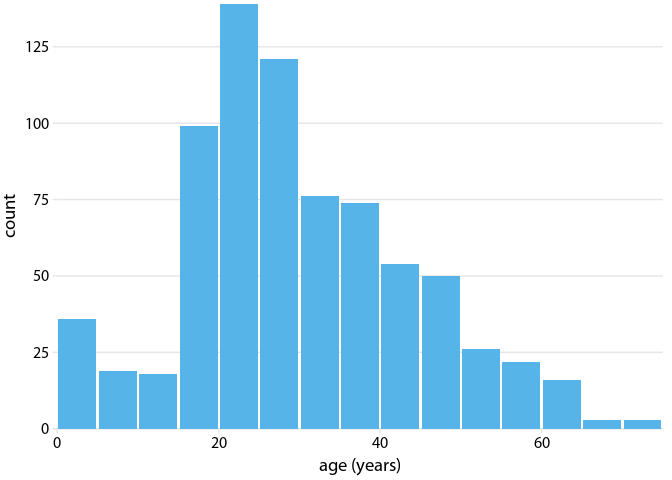
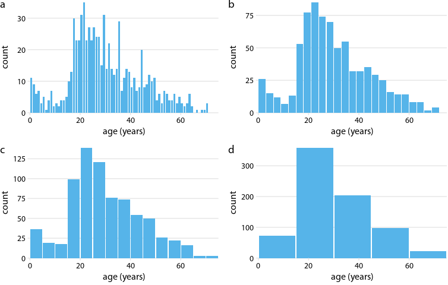
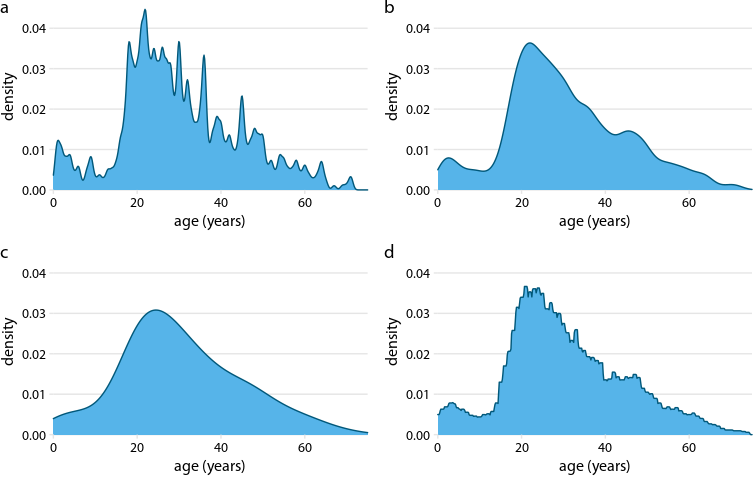
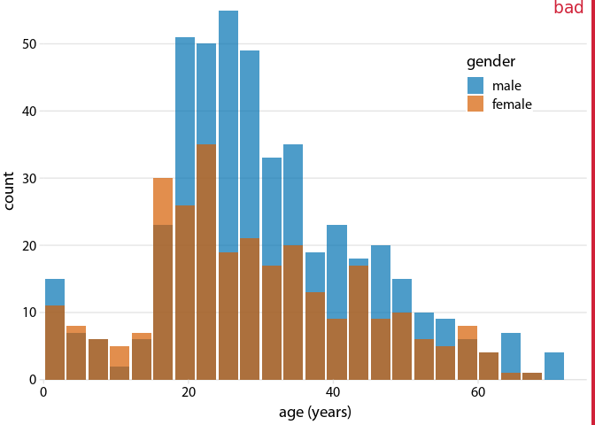
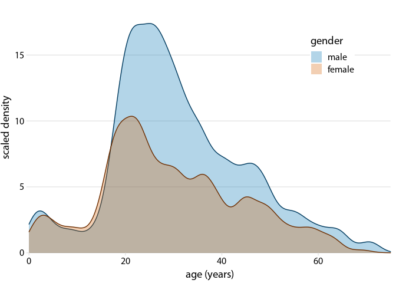
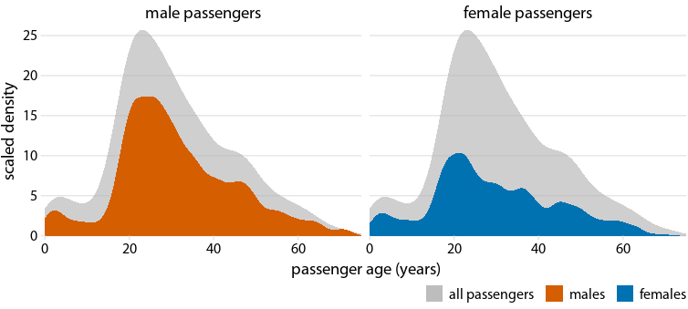
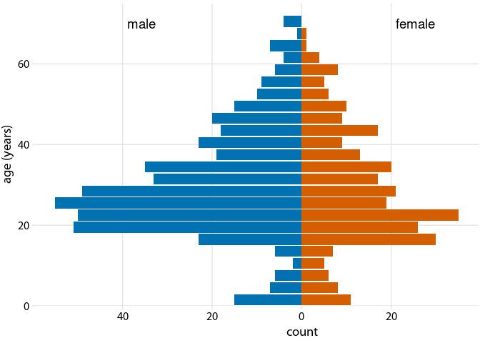

ch07\_visualizing\_distributions\_I
================

``` r
library(forcats)
library(patchwork)
library(lubridate)
```

    ## 
    ## 다음의 패키지를 부착합니다: 'lubridate'

    ## The following objects are masked from 'package:base':
    ## 
    ##     date, intersect, setdiff, union

``` r
library(cowplot)
```

    ## 
    ## 다음의 패키지를 부착합니다: 'cowplot'

    ## The following object is masked from 'package:lubridate':
    ## 
    ##     stamp

    ## The following object is masked from 'package:patchwork':
    ## 
    ##     align_plots

``` r
library(dviz.supp)
```

    ## 필요한 패키지를 로딩중입니다: colorspace

    ## 필요한 패키지를 로딩중입니다: colorblindr

    ## 필요한 패키지를 로딩중입니다: ggplot2

    ## 필요한 패키지를 로딩중입니다: dplyr

    ## 
    ## 다음의 패키지를 부착합니다: 'dplyr'

    ## The following objects are masked from 'package:stats':
    ## 
    ##     filter, lag

    ## The following objects are masked from 'package:base':
    ## 
    ##     intersect, setdiff, setequal, union

    ## 
    ## 다음의 패키지를 부착합니다: 'dviz.supp'

    ## The following objects are masked from 'package:cowplot':
    ## 
    ##     plot_grid, stamp, stamp_bad, stamp_good, stamp_ugly, stamp_wrong

    ## The following object is masked from 'package:lubridate':
    ## 
    ##     stamp

    ## The following object is masked from 'package:datasets':
    ## 
    ##     CO2

``` r
library(gapminder)
library(ggridges) # for geom_density_line()
```

    ## 
    ## 다음의 패키지를 부착합니다: 'ggridges'

    ## The following object is masked from 'package:dviz.supp':
    ## 
    ##     Aus_athletes

``` r
library(tidyr)
```

# 단일 분포 상태의 시각화

``` r
titanic <- titanic_all
age_counts <- hist(titanic$age, breaks = (0:15) * 5 + .01, plot = FALSE)$counts
age_hist1 <- data.frame(
  `age range` = c("0--5", "6--10", "11--15", "16--20", "21--25", "26--30", "31--35", "36--40", "41--45", "46--50", "51--55", "56--60", "61--65", "66--70", "71--75"),
  count = age_counts,
  check.names = FALSE
)

age_hist_display <- rename(
  age_hist1,
  `Age range` = `age range`,
  Count = count
)

knitr::kable(
  list(
    age_hist_display[1:6,], age_hist_display[7:12,], age_hist_display[13:15,]
  ),
  caption = 'Numbers of passenger with known age on the Titanic.', booktabs = TRUE,
  row.names = FALSE
)
```

<table class="kable_wrapper">
<caption>
Numbers of passenger with known age on the Titanic.
</caption>
<tbody>
<tr>
<td>

| Age range | Count |
|:----------|------:|
| 0–5       |    36 |
| 6–10      |    19 |
| 11–15     |    18 |
| 16–20     |    99 |
| 21–25     |   139 |
| 26–30     |   121 |

</td>
<td>

| Age range | Count |
|:----------|------:|
| 31–35     |    76 |
| 36–40     |    74 |
| 41–45     |    54 |
| 46–50     |    50 |
| 51–55     |    26 |
| 56–60     |    22 |

</td>
<td>

| Age range | Count |
|:----------|------:|
| 61–65     |    16 |
| 66–70     |     3 |
| 71–75     |     3 |

</td>
</tr>
</tbody>
</table>

``` r
age_hist <- cbind(age_hist1, age = (1:15) * 5 - 2.5)
h1 <- ggplot(age_hist, aes(x = age, y = count)) + geom_col(width = 4.7, fill = "#56B4E9")  + 
  scale_y_continuous(expand = c(0, 0), breaks = 25 * (0:5)) +
  scale_x_continuous(name = "age (years)", limits = c(0, 75), expand = c(0, 0)) +
  coord_cartesian(clip = "off") +
  theme_dviz_hgrid() +
  theme(
    axis.line.x = element_blank(),
    plot.margin = margin(3, 7, 3, 1.5)
  )
h1
```


\#\# 구간 폭에 따른 히스토그램

``` r
age_hist_1 <- data.frame(
  age = (1:75) - 0.5, 
  count = hist(titanic$age, breaks = (0:75) + .01, plot = FALSE)$counts
)

age_hist_3 <- data.frame(
  age = (1:25) * 3 - 1.5, 
  count = hist(titanic$age, breaks = (0:25) * 3 + .01, plot = FALSE)$counts
)

age_hist_15 <- data.frame(
  age = (1:5) * 15 - 7.5, 
  count = hist(titanic$age, breaks = (0:5) * 15 + .01, plot = FALSE)$counts
)

h2 <- ggplot(age_hist_1, aes(x = age, y = count)) + 
  geom_col(width = .85, fill = "#56B4E9")  + 
  scale_y_continuous(expand = c(0, 0), breaks = 10 * (0:5)) +
  scale_x_continuous(name = "age (years)", limits = c(0, 75), expand = c(0, 0)) +
  coord_cartesian(clip = "off") +
  theme_dviz_hgrid(12) +
  theme(
    axis.line.x = element_blank(),
    plot.margin = margin(3, 1.5, 3, 1.5)
  )

h3 <- ggplot(age_hist_3, aes(x = age, y = count)) + geom_col(width = 2.75, fill = "#56B4E9")  + 
  scale_y_continuous(expand = c(0, 0), breaks = 25 * (0:5)) +
  scale_x_continuous(name = "age (years)", limits = c(0, 75), expand = c(0, 0)) +
  coord_cartesian(clip = "off") +
  theme_dviz_hgrid(12) +
  theme(
    axis.line.x = element_blank(),
    plot.margin = margin(3, 1.5, 3, 1.5)
  )

h4 <- ggplot(age_hist_15, aes(x = age, y = count)) + geom_col(width = 14.5, fill = "#56B4E9")  + 
  scale_y_continuous(expand = c(0, 0), breaks = 100 * (0:4)) +
  scale_x_continuous(name = "age (years)", limits = c(0, 75), expand = c(0, 0)) +
  coord_cartesian(clip = "off") +
  theme_dviz_hgrid(12) +
  theme(
    axis.line.x = element_blank(),
    plot.margin = margin(3, 1.5, 3, 1.5)
  )


plot_grid(
  h2, NULL, h3,
  NULL, NULL, NULL,
  h1 + theme_dviz_hgrid(12) + theme(axis.line.x = element_blank(), plot.margin = margin(3, 1.5, 3, 1.5)),
  NULL, h4,
  align = 'hv',
  labels = c("a", "", "b", "", "", "", "c", "", "d"),
  rel_widths = c(1, .04, 1),
  rel_heights = c(1, .04, 1)
)
```



# 밀도 도표

``` r
ggplot(titanic, aes(x = age)) + 
  geom_density_line(fill = "#56B4E9", color = darken("#56B4E9", 0.5), bw = 2, kernel = "gaussian") + 
  scale_y_continuous(limits = c(0, 0.046), expand = c(0, 0), name = "density") +
  scale_x_continuous(name = "age (years)", limits = c(0, 75), expand = c(0, 0)) +
  coord_cartesian(clip = "off") +
  theme_dviz_hgrid() +
  theme(
    axis.line.x = element_blank(),
    plot.margin = margin(3, 7, 3, 1.5)
  )
```

    ## Warning: Removed 557 rows containing non-finite values (stat_density).


\# 밀도 도표 - 다양한 구간 by smoothing bandwidth (bw)

``` r
pdens1 <- ggplot(titanic, aes(x = age)) + 
  geom_density_line(fill = "#56B4E9", color = darken("#56B4E9", 0.5), bw = .5, kernel = "gaussian") + 
  scale_y_continuous(limits = c(0, 0.046), expand = c(0, 0), name = "density") +
  scale_x_continuous(name = "age (years)", limits = c(0, 75), expand = c(0, 0)) +
  coord_cartesian(clip = "off") +
  theme_dviz_hgrid(12) +
  theme(
    axis.line.x = element_blank(),
    plot.margin = margin(3, 1.5, 3, 1.5)
  )

pdens2 <- ggplot(titanic, aes(x = age)) + 
  geom_density_line(fill = "#56B4E9", color = darken("#56B4E9", 0.5), bw = 2, kernel = "gaussian") + 
  scale_y_continuous(limits = c(0, 0.046), expand = c(0, 0), name = "density") +
  scale_x_continuous(name = "age (years)", limits = c(0, 75), expand = c(0, 0)) +
  coord_cartesian(clip = "off") +
  theme_dviz_hgrid(12) +
  theme(
    axis.line.x = element_blank(),
    plot.margin = margin(3, 1.5, 3, 1.5)
  )

pdens3 <- ggplot(titanic, aes(x = age)) + 
  geom_density_line(fill = "#56B4E9", color = darken("#56B4E9", 0.5), bw = 5, kernel = "gaussian") + 
  scale_y_continuous(limits = c(0, 0.046), expand = c(0, 0), name = "density") +
  scale_x_continuous(name = "age (years)", limits = c(0, 75), expand = c(0, 0)) +
  coord_cartesian(clip = "off") +
  theme_dviz_hgrid(12) +
  theme(
    axis.line.x = element_blank(),
    plot.margin = margin(3, 1.5, 3, 1.5)
  )

pdens4 <- ggplot(titanic, aes(x = age)) + 
  geom_density_line(fill = "#56B4E9", color = darken("#56B4E9", 0.5), bw = 2, kernel = "rectangular") + 
  scale_y_continuous(limits = c(0, 0.046), expand = c(0, 0), name = "density") +
  scale_x_continuous(name = "age (years)", limits = c(0, 75), expand = c(0, 0)) +
  coord_cartesian(clip = "off") +
  theme_dviz_hgrid(12) +
  theme(
    axis.line.x = element_blank(),
    plot.margin = margin(3, 1.5, 3, 1.5)
  )

plot_grid(
  pdens1, NULL, pdens2, 
  NULL, NULL, NULL,
  pdens3, NULL, pdens4,
  align = 'hv',
  labels = c("a", "", "b", "", "", "", "c", "", "d"),
  rel_widths = c(1, .04, 1),
  rel_heights = c(1, .04, 1)
)
```

    ## Warning: Removed 557 rows containing non-finite values (stat_density).

    ## Warning: Removed 557 rows containing non-finite values (stat_density).

    ## Warning: Removed 557 rows containing non-finite values (stat_density).

    ## Warning: Removed 557 rows containing non-finite values (stat_density).


\# 여러 분포 상태를 하나의 도표로 시각화(Stack) －모두 0에서 시작하지
않아 모호함

``` r
data.frame(
  age = (1:25)*3 - 1.5, 
  male = hist(filter(titanic, sex == "male")$age, breaks = (0:25)*3 + .01, plot = FALSE)$counts,
  female = hist(filter(titanic, sex == "female")$age, breaks = (0:25)*3 + .01, plot = FALSE)$counts
) %>%
  gather(gender, count, -age) -> gender_counts   

gender_counts$gender <- factor(gender_counts$gender, levels = c("female", "male"))

p_hist_stacked <- ggplot(gender_counts, aes(x = age, y = count, fill = gender)) + 
  geom_col(position = "stack") +
  scale_x_continuous(name = "age (years)", limits = c(0, 75), expand = c(0, 0)) +
  scale_y_continuous(limits = c(0, 89), expand = c(0, 0), name = "count") +
  scale_fill_manual(values = c("#D55E00", "#0072B2")) +
  coord_cartesian(clip = "off") +
  theme_dviz_hgrid() +
  theme(
    axis.line.x = element_blank(),
    legend.position = c(.9, .87),
    legend.justification = c("right", "top"),
    legend.box.background = element_rect(fill = "white", color = "white"),
    plot.margin = margin(3, 7, 3, 1.5)
  )

stamp_bad(p_hist_stacked)
```


# 여러 분포 상태를 하나의 도표로 시각화(Identity) －0에서 시작하지만 범주가 3개처럼 보이는 착시현상

``` r
p_hist_overlapped <- ggplot(gender_counts, aes(x = age, y = count, fill = gender)) + 
  geom_col(position = "identity", alpha = 0.7) +
  scale_x_continuous(name = "age (years)", limits = c(0, 75), expand = c(0, 0)) +
  scale_y_continuous(limits = c(0, 56), expand = c(0, 0), name = "count") +
  scale_fill_manual(
    values = c("#D55E00", "#0072B2"),
    guide = guide_legend(reverse = TRUE)
  ) +
  coord_cartesian(clip = "off") +
  theme_dviz_hgrid() +
  theme(
    axis.line.x = element_blank(),
    legend.position = c(.9, .87),
    legend.justification = c("right", "top"),
    legend.box.background = element_rect(fill = "white", color = "white"),
    plot.margin = margin(3, 7, 3, 1.5)
  )

stamp_bad(p_hist_overlapped)
```



# 중첩 밀도 함수(good\~!)

``` r
titanic2 <- titanic
titanic2$sex <- factor(titanic2$sex, levels = c("male", "female"))

ggplot(titanic2, aes(x = age, y = ..count.., fill = sex, color = sex)) +  # <-- 여기
  geom_density_line(bw = 2, alpha = 0.3) +
  scale_x_continuous(name = "age (years)", limits = c(0, 75), expand = c(0, 0)) +
  scale_y_continuous(limits = c(0, 19), expand = c(0, 0), name = "scaled density") +
  scale_fill_manual(values = c("#0072B2", "#D55E00"), name = "gender") +
  scale_color_manual(values = darken(c("#0072B2", "#D55E00"), 0.5), name = "gender") +
  guides(fill = guide_legend(override.aes = list(linetype = 0))) +
  coord_cartesian(clip = "off") +
  theme_dviz_hgrid() +
  theme(
    axis.line.x = element_blank(),
    legend.position = c(.9, .87),
    legend.justification = c("right", "top"),
    legend.box.background = element_rect(fill = "white", color = "white"),
    plot.margin = margin(3, 7, 3, 1.5)
  )
```

    ## Warning: Removed 557 rows containing non-finite values (stat_density).



# 중첩 밀도 함수 - 전체 대비 각자의 분포를 보여줌

all, male, female 다 하나 안에 그리고, facet으로 분리

``` r
ggplot(titanic2, aes(x = age, y = ..count..)) +
  geom_density_line(
    data = select(titanic, -sex), 
    aes(fill = "all passengers"),
    color = "transparent"
  ) + 
  geom_density_line(aes(fill = sex), bw = 2, color = "transparent") +
  scale_x_continuous(limits = c(0, 75), name = "passenger age (years)", expand = c(0, 0)) +
  scale_y_continuous(limits = c(0, 26), name = "scaled density", expand = c(0, 0)) +
  scale_fill_manual(
    values = c("#b3b3b3a0", "#D55E00", "#0072B2"), 
    breaks = c("all passengers", "male", "female"),
    labels = c("all passengers  ", "males  ", "females"),
    name = NULL,
    guide = guide_legend(direction = "horizontal")
  ) +
  coord_cartesian(clip = "off") +
  facet_wrap(~sex, labeller = labeller(sex = function(sex) paste(sex, "passengers"))) +
  theme_dviz_hgrid() +
  theme(
    axis.line.x = element_blank(),
    strip.text = element_text(size = 14, margin = margin(0, 0, 0.2, 0, "cm")),
    legend.position = "bottom",
    legend.justification = "right",
    legend.margin = margin(4.5, 0, 1.5, 0, "pt"),
    legend.spacing.x = grid::unit(4.5, "pt"),
    legend.spacing.y = grid::unit(0, "pt"),
    legend.box.spacing = grid::unit(0, "cm")
  )
```

    ## Warning: Removed 1114 rows containing non-finite values (stat_density).

    ## Warning: Removed 557 rows containing non-finite values (stat_density).



# 연령 피라미드 ( y를 성별에 따라 +1과 -1 방향으로 )

``` r
ggplot(gender_counts, aes(x = age, y = ifelse(gender == "male",-1, 1)*count, fill = gender)) + 
  geom_col() +
  scale_x_continuous(name = "age (years)", limits = c(0, 75), expand = c(0, 0)) +
  scale_y_continuous(name = "count", breaks = 20*(-2:1), labels = c("40", "20", "0", "20")) +
  scale_fill_manual(values = c("#D55E00", "#0072B2"), guide = "none") +
  draw_text(x = 70, y = -39, "male", hjust = 0) +
  draw_text(x = 70, y = 21, "female", hjust = 0) +
  coord_flip() +
  theme_dviz_grid() +
  theme(axis.title.x = element_text(hjust = 0.61))
```



aa
