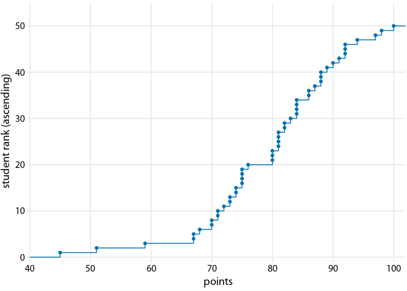

visualizing\_distributions\_II
================

``` r
library(forcats)
library(patchwork)
library(lubridate)
```

    ## 
    ## 다음의 패키지를 부착합니다: 'lubridate'

    ## The following objects are masked from 'package:base':
    ## 
    ##     date, intersect, setdiff, union

``` r
library(cowplot)
```

    ## 
    ## 다음의 패키지를 부착합니다: 'cowplot'

    ## The following object is masked from 'package:lubridate':
    ## 
    ##     stamp

    ## The following object is masked from 'package:patchwork':
    ## 
    ##     align_plots

``` r
library(dviz.supp)
```

    ## 필요한 패키지를 로딩중입니다: colorspace

    ## 필요한 패키지를 로딩중입니다: colorblindr

    ## 필요한 패키지를 로딩중입니다: ggplot2

    ## 필요한 패키지를 로딩중입니다: dplyr

    ## 
    ## 다음의 패키지를 부착합니다: 'dplyr'

    ## The following objects are masked from 'package:stats':
    ## 
    ##     filter, lag

    ## The following objects are masked from 'package:base':
    ## 
    ##     intersect, setdiff, setequal, union

    ## 
    ## 다음의 패키지를 부착합니다: 'dviz.supp'

    ## The following objects are masked from 'package:cowplot':
    ## 
    ##     plot_grid, stamp, stamp_bad, stamp_good, stamp_ugly, stamp_wrong

    ## The following object is masked from 'package:lubridate':
    ## 
    ##     stamp

    ## The following object is masked from 'package:datasets':
    ## 
    ##     CO2

``` r
library(gapminder)
library(ggridges) # for geom_density_line()
```

    ## 
    ## 다음의 패키지를 부착합니다: 'ggridges'

    ## The following object is masked from 'package:dviz.supp':
    ## 
    ##     Aus_athletes

``` r
library(tidyr)
```

# 경험적 누적 분포 함수

``` r
set.seed(4211)
points = round(c(rnorm(47, mean = 82, sd = 10), 45, 51, 67))
points[points > 100] <- 100
student_data <- data.frame(points, rank = rank(points, ties.method = "random"))
ggplot(student_data, aes(x = points, y = 50*..y..)) + 
  stat_ecdf(geom = "step", color = "#0072B2") +
  geom_point(aes(y = rank), color = "#0072B2") +
  scale_x_continuous(limits = c(40, 102), expand = c(0, 0), breaks = 10*(4:10)) +
  scale_y_continuous(limits = c(-.5, 55), expand = c(0, 0), name = "student rank (ascending)") +
  coord_cartesian(clip = "off") +
  theme_dviz_grid() +
  theme(axis.line.x = element_blank())
```



## 경험적 누적 분포 함수 - 내림차순

``` r
ggplot(student_data, aes(x = points, y = 51-50*..y..)) +    # <-- 여기
  stat_ecdf(geom = "step", color = "#0072B2") +
  geom_point(aes(y = 51-rank), color = "#0072B2") +
  scale_x_continuous(limits = c(40, 102), expand = c(0, 0), breaks = 10*(4:10)) +
  scale_y_continuous(limits = c(-.5, 55), expand = c(0, 0), name = "student rank (descending)") +
  coord_cartesian(clip = "off") +
  theme_dviz_grid() +
  theme(axis.line.x = element_blank())
```


## 경험적 누적 분포 함수 - 정규화

``` r
ggplot(student_data, aes(x = points, y = ..y..)) +    # <-- 여기
  stat_ecdf(geom = "step", color = "#0072B2", size = 0.75) +
  scale_x_continuous(limits = c(40, 102), expand = c(0, 0), breaks = 10*(4:10)) +
  scale_y_continuous(limits = c(-.01, 1.01), expand = c(0, 0), name = "cumulative frequency") +
  coord_cartesian(clip = "off") +
  theme_dviz_grid() +
  theme(axis.line.x = element_blank())
```


# 고도의 비대칭 분포

``` r
 p1 <- ggplot(US_census, aes(x=pop2010)) + 
  geom_density(fill = "#56B4E9", color = "transparent") +
  scale_x_continuous(expand = c(0.01, 0), name = "number of inhabitants",
                     limits = c(0, 2.3e6),
                     breaks = 0.5e6*(0:4),
                     labels = label_log10) +
  scale_y_continuous(expand = c(0, 0), name = expression(paste("density [x", 10^-5, "]")),
                     breaks = c(0, 4e-6, 8e-6, 1.2e-5, 1.6e-5),
                     labels = c(0, 0.4, 0.8, 1.2, 1.6)) +
  coord_cartesian(clip = "off") +
  theme_dviz_grid(12) +
  theme(plot.margin = margin(3, 1.5, 12, 1.5))

p2 <- ggplot(US_census, aes(x=pop2010)) + 
  stat_ecdf(geom = "step", color = "#0072B2", pad = FALSE) +
  scale_x_continuous(expand = c(0.01, 0), name = "number of inhabitants",
                     limits = c(0, 2.3e6),
                     breaks = 0.5e6*(0:4),
                     labels = label_log10) +
  scale_y_continuous(expand = c(0.01, 0), name = "cumulative frequency") +
  coord_cartesian(clip = "off") +
  theme_dviz_grid(12) +
  theme(plot.margin = margin(3, 1.5, 12, 1.5))

plot_grid(p1, p2, ncol = 1, align = 'v', labels = 'auto')
```

    ## Warning: Removed 9 rows containing non-finite values (stat_density).

    ## Warning: Removed 9 rows containing non-finite values (stat_ecdf).


## 고도의 비대칭 분포 - 로그스케일(good!)

``` r
p1_log <- ggplot(US_census, aes(x=log10(pop2010))) +   # <-- 여기
  geom_density(fill = "#56B4E9", color = "transparent") +
  scale_x_continuous(
    expand = c(0.01, 0),
    name = expression(paste("log"["10"], "(number of inhabitants)"))
  ) +
  scale_y_continuous(expand = c(0, 0), name = "density") +
  coord_cartesian(clip = "off") +
  theme_dviz_grid(12) +
  theme(plot.margin = margin(3, 1.5, 12, 1.5))

p2_log <- ggplot(US_census, aes(x=log10(pop2010))) +    # <-- 여기
  stat_ecdf(geom = "step", color = "#0072B2", pad = FALSE) +
  scale_x_continuous(
    expand = c(0.01, 0),
    name = expression(paste("log"["10"], "(number of inhabitants)"))
  ) +
  scale_y_continuous(expand = c(0.01, 0), name = "cumulative frequency") +
  coord_cartesian(clip = "off") +
  theme_dviz_grid(12) +
  theme(plot.margin = margin(3, 1.5, 12, 1.5))

plot_grid(p1_log, p2_log, ncol = 1, align = 'v', labels = 'auto')
```


# Quantile–quantile plots

``` r
# estimate distribution parameters (mean and sd)
params <- as.list(MASS::fitdistr(student_data$points, "normal")$estimate)

# axis line segments
df_segment <- data.frame(
  x = c(50, -Inf), 
  xend = c(100, -Inf),
  y = c(-Inf, 50),
  yend = c(-Inf, 100)
)

ggplot(student_data, aes(sample = points)) + 
  geom_abline(slope = 1, intercept = 0, color = "grey70") +
  stat_qq(dparams = params, color = "#0072B2") +
  geom_segment(
    data = df_segment,
    aes(x = x, xend = xend, y = y, yend = yend),
    size = 0.5, inherit.aes = FALSE) +
  scale_x_continuous(limits = c(43, 107), expand = c(0, 0), breaks = 10*(5:10)) +
  scale_y_continuous(limits = c(43, 102), expand = c(0, 0), breaks = 10*(5:10), name = "observed") +
  coord_fixed(clip = "off") +
  theme_dviz_open() +
  theme(axis.line = element_blank())
```


