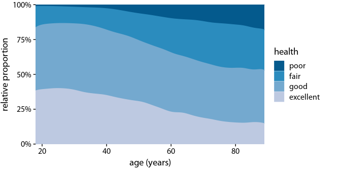

R Notebook
================

``` r
library(forcats)
library(patchwork)
library(lubridate)
```

    ## 
    ## 다음의 패키지를 부착합니다: 'lubridate'

    ## The following objects are masked from 'package:base':
    ## 
    ##     date, intersect, setdiff, union

``` r
library(cowplot)
```

    ## 
    ## 다음의 패키지를 부착합니다: 'cowplot'

    ## The following object is masked from 'package:lubridate':
    ## 
    ##     stamp

    ## The following object is masked from 'package:patchwork':
    ## 
    ##     align_plots

``` r
library(dviz.supp)
```

    ## 필요한 패키지를 로딩중입니다: colorspace

    ## 필요한 패키지를 로딩중입니다: colorblindr

    ## 필요한 패키지를 로딩중입니다: ggplot2

    ## 필요한 패키지를 로딩중입니다: dplyr

    ## 
    ## 다음의 패키지를 부착합니다: 'dplyr'

    ## The following objects are masked from 'package:stats':
    ## 
    ##     filter, lag

    ## The following objects are masked from 'package:base':
    ## 
    ##     intersect, setdiff, setequal, union

    ## 
    ## 다음의 패키지를 부착합니다: 'dviz.supp'

    ## The following objects are masked from 'package:cowplot':
    ## 
    ##     plot_grid, stamp, stamp_bad, stamp_good, stamp_ugly, stamp_wrong

    ## The following object is masked from 'package:lubridate':
    ## 
    ##     stamp

    ## The following object is masked from 'package:datasets':
    ## 
    ##     CO2

``` r
library(gapminder)
library(ggridges) # for geom_density_line()
```

    ## 
    ## 다음의 패키지를 부착합니다: 'ggridges'

    ## The following object is masked from 'package:dviz.supp':
    ## 
    ##     Aus_athletes

``` r
library(ggforce)
```

    ## 
    ## 다음의 패키지를 부착합니다: 'ggforce'

    ## The following objects are masked from 'package:dviz.supp':
    ## 
    ##     stat_sina, StatSina

``` r
library(tidyr)
```

# Visualizing proportions

``` r
main_size = 14 / .pt
small_rel <- 12/14
small_size <- small_rel * main_size

# calculate the start and end angles for each pie
bund_pie <- bundestag %>%
  arrange(seats) %>%
  mutate(
    seat_total = sum(seats),
    end_angle = 2*pi*cumsum(seats)/seat_total,   # ending angle for each pie slice
    start_angle = lag(end_angle, default = 0),   # starting angle for each pie slice
    mid_angle = 0.5*(start_angle + end_angle),   # middle of each pie slice, for the text label
    hjust = ifelse(mid_angle>pi, 1, 0),
    vjust = ifelse(mid_angle<pi/2 | mid_angle>3*pi/2, 0, 1)
  )

rpie = 1
rlabel = 1.05 * rpie

ggplot(bund_pie) + 
  geom_arc_bar(
    aes(
      x0 = 0, y0 = 0, r0 = 0, r = rpie,
      start = start_angle, end = end_angle, fill = party
    ),
    color = "white", size = 0.5
  ) +
  geom_text(
    aes(
      x = rlabel*sin(mid_angle),
      y = rlabel*cos(mid_angle),
      label = party,
      hjust = hjust, vjust = vjust
    ),
    family = dviz_font_family, size = main_size
  ) +
  geom_text(
    aes(
      x = 0.6*sin(mid_angle),
      y = 0.6*cos(mid_angle),
      label = seats
    ),
    family = dviz_font_family, size = main_size,
    color = c("black", "white", "white")
  ) +
  coord_fixed(clip = "off") +
  scale_x_continuous(
    limits = c(-1.5, 1.5),
    expand = c(0, 0),
    name = "",
    breaks = NULL,
    labels = NULL
  ) +
  scale_y_continuous(
    limits = c(-1.01, 1.15),
    expand = c(0, 0),
    name = "",
    breaks = NULL,
    labels = NULL
  ) +
  scale_fill_manual(
    values = bund_pie$colors[order(bund_pie$party)]
  ) +
  theme_dviz_map() +
  theme(
    legend.position = "none",
    plot.margin = margin(3.5, 1.5, 3.5, 1.5)
  )
```


## A case for side-by-side bars

``` r
ggplot(marketshare, aes(x = company, y = percent, fill = company)) + 
  geom_col() + 
  facet_wrap(~year) +
  scale_y_continuous(
    name = "market share",
    labels = scales::percent_format(accuracy = 1, scale = 1),
    expand = c(0, 0)
  ) +
  scale_fill_OkabeIto(order = c(1:3, 5, 4), guide = "none") + 
  theme_dviz_open() +
  theme(strip.background = element_blank())
```


## A case for stacked bars and stacked densities

``` r
ccode = "RWA" # Rwanda
#ccode = "BEL" # Belgium
#ccode = "ARB" # Arab world
#ccode = "BOL" # Bolivia
#ccode = "EUU" # European Union

women_parliaments %>% filter(country_code == ccode & year > 1990) %>%
  mutate(women = perc_women, men = 100 - perc_women) %>%
  select(-perc_women) %>%
  gather(gender, percent, women, men) %>%
  mutate(gender = factor(gender, levels = c("women", "men"))) -> women_rwanda

plot_base <- ggplot(women_rwanda, aes(x = year, y = percent, fill = gender)) +
    #geom_col(position = "stack", width = .9, color = "white") +
    geom_col(position = "stack", width = 1, color = "#FFFFFF", size = .75, alpha = 0.8) +
    geom_hline(
      yintercept = c(50),
      color = "#000000FF", size = 0.4, linetype = 2
      #color = "#FFFFFFA0"
    ) +
    geom_hline(yintercept = 100, color = "black") +
    scale_x_continuous(expand = c(0, 0)) +
    scale_y_continuous(
      name = "relative proportion",
      labels = scales::percent_format(accuracy = 1, scale = 1),
      expand = c(0, 0)
    ) +
    scale_fill_manual(values = c("#D55E00E0", "#0072B2E0"), guide = "none") +
    coord_cartesian(clip = "off") +
    theme_dviz_open() + 
    theme(
      #axis.ticks.y = element_blank(),
      #axis.ticks.x = element_blank(),
      #axis.line.x = element_blank(),
      axis.line.y = element_blank(),
      plot.margin = margin(14, 1.5, 3, 1.5)
    )

# calculate label position
labels <- filter(women_rwanda, year == max(year)) %>%
  mutate(pos = 100 - cumsum(percent) + 0.5*percent)

yax <- axis_canvas(plot_base, axis = "y") +
  geom_text(data = labels, aes(y = pos, label = paste0(" ", gender)),
            family = dviz_font_family,
            x = 0, hjust = 0, size = 14/.pt)

ggdraw(insert_yaxis_grob(plot_base, yax, grid::unit(.15, "null")))
```


``` r
df_health <- select(happy, age, health) %>%
  na.omit()

# color brewer 5-class PuBu
colors = c('#f1eef6', '#bdc9e1', '#74a9cf', '#2b8cbe', '#045a8d')[5:1]

p_health <- ggplot(df_health, aes(x = age, y = ..count.., fill = health, color = health)) + 
  geom_density(position = "fill") +    # <--- 여기
  #geom_hline(yintercept = c(.25, .50, .75), color = "#FFFFFF60") +
  scale_x_continuous(name = "age (years)", expand = c(0, 0)) +
  scale_y_continuous(
    expand = c(0, 0), name = "relative proportion",
    labels = scales::percent
  ) + 
  scale_color_manual(values = colors) + 
  scale_fill_manual(values = colors) +
  theme_dviz_open() + 
  theme(
    #axis.ticks.y = element_blank(),
    #axis.ticks.x = element_blank(),
    axis.line.x = element_blank(),
    axis.line.y = element_blank(),
    plot.margin = margin(7, 7, 3, 1.5)
  )

df_marital <- select(happy, age, marital) %>%
  na.omit() %>%
  filter(marital != "separated") %>% # remove separated to make plot simpler
  mutate(marital = factor(marital, levels = c("widowed", "divorced", "married", "never married")))

p_marital <- ggplot(df_marital, aes(x = age, y = ..count.., fill = marital, color = marital)) + 
  geom_density(position = "fill") +
  scale_x_continuous(name = "age (years)", expand = c(0, 0)) +
  scale_y_continuous(
    expand = c(0, 0), name = "relative proportion",
    labels = scales::percent
  ) + 
  scale_color_manual(values = colors, name = "marital status") + 
  scale_fill_manual(values = colors, name = "marital status") +
  theme_dviz_open() + 
  theme(
    #axis.ticks.y = element_blank(),
    axis.line.x = element_blank(),
    axis.line.y = element_blank(),
    plot.margin = margin(7, 7, 3, 1.5)
  )

p_aligned <- align_plots(p_health, p_marital, align = 'v')
ggdraw(p_aligned[[1]])
```



``` r
stamp_bad(p_aligned[[2]])
```


``` r
ggplot(mutate(df_marital, marital = fct_rev(marital)), aes(x = age, y = ..count..)) +
  geom_density_line(data = select(df_marital, -marital), aes(fill = "all people surveyed  "), color = "transparent") +
  geom_density_line(aes(fill = "highlighted group"), color = "transparent") +
  facet_wrap(~marital, nrow = 1) +
  scale_x_continuous(name = "age (years)", limits = c(15, 98), expand = c(0, 0)) +
  scale_y_continuous(name = "count", expand = c(0, 0)) +
  scale_fill_manual(
    values = c("#b3b3b3a0", "#2b8cbed0"),
    name = NULL,
    guide = guide_legend(direction = "horizontal")
  ) +
  coord_cartesian(clip = "off") +
  theme_dviz_hgrid() +
  theme(
    axis.line.x = element_blank(),
    strip.text = element_text(size = 14, margin = margin(0, 0, 0.2, 0, "cm")),
    legend.position = "bottom",
    legend.justification = "right",
    legend.margin = margin(4.5, 0, 1.5, 0, "pt"),
    legend.spacing.x = grid::unit(4.5, "pt"),
    legend.spacing.y = grid::unit(0, "pt"),
    legend.box.spacing = grid::unit(0, "cm")
  )
```


``` r
df_marital2 <- rbind(
  mutate(df_marital,
    marital = as.character(fct_collapse(marital, `never married` = "never married", aother = c("married", "divorced", "widowed"))),
    highlight = "never married"
  ),
  mutate(df_marital,
    marital = as.character(fct_collapse(marital, married = "married", aother = c("never married", "divorced", "widowed"))),
    highlight = "married"
  ),
  mutate(df_marital,
    marital = as.character(fct_collapse(marital, divorced = "divorced", aother = c("never married", "married", "widowed"))),
    highlight = "divorced"
  ),
  mutate(df_marital,
    marital = as.character(fct_collapse(marital, widowed = "widowed", aother = c("never married", "married", "divorced"))),
    highlight = "widowed"
  )
) %>%
  mutate(
    highlight = factor(highlight, levels = c("never married", "married", "divorced", "widowed"))
  )

ggplot(df_marital2, aes(age)) +
  annotate(geom = "rect", xmin = -Inf, xmax = Inf, ymin = -Inf, ymax = Inf, fill = "#b3b3b3a0", color = NA) +
  geom_density_line(
    aes(y = stat(count), fill = marital), color = "transparent", position = "fill"
  ) +
  facet_wrap(~highlight, nrow = 1) +
  scale_x_continuous(
    name = "age (years)",
    #limits = c(15, 98), 
    expand = c(0, 0)
  ) +
  scale_y_continuous(name = "relative proportion", expand = c(0, 0), labels = scales::percent) +
  scale_fill_manual(
    values = c("transparent", "#2b8cbed0", "#2b8cbed0", "#2b8cbed0", "#2b8cbed0"),
    name = NULL,
    breaks = c("aother", "widowed"),
    labels = c("all people surveyed  ", "highlighted group"),
    guide = guide_legend(
      direction = "horizontal",
      override.aes = list(fill = c("#bebebe", "#3590c0"))
    )
  ) +
  coord_cartesian(clip = "off") +
  theme_dviz_hgrid() +
  theme(
    axis.line.x = element_blank(),
    strip.text = element_text(size = 14, margin = margin(0, 0, 0.2, 0, "cm")),
    legend.position = "bottom",
    legend.justification = "right",
    legend.margin = margin(4.5, 0, 1.5, 0, "pt"),
    legend.spacing.x = grid::unit(4.5, "pt"),
    legend.spacing.y = grid::unit(0, "pt"),
    legend.box.spacing = grid::unit(0, "cm")
  )
```


Add a new chunk by clicking the *Insert Chunk* button on the toolbar or
by pressing *Ctrl+Alt+I*.

When you save the notebook, an HTML file containing the code and output
will be saved alongside it (click the *Preview* button or press
*Ctrl+Shift+K* to preview the HTML file).

The preview shows you a rendered HTML copy of the contents of the
editor. Consequently, unlike *Knit*, *Preview* does not run any R code
chunks. Instead, the output of the chunk when it was last run in the
editor is displayed.
